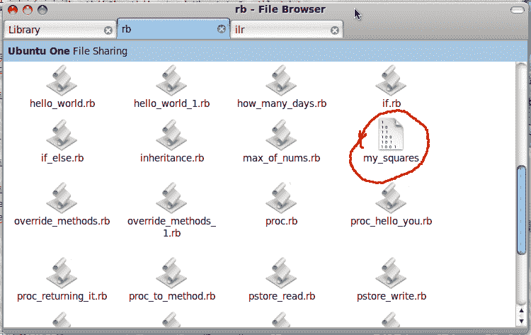

## 19.文件

到目前为止，您已经将数据存储在程序的变量中。 当程序停止执行或计算机关闭或从内存中删除程序时，变量数据将丢失。 如果要永久存储，则必须将其存储在文件中。 当您将数据存储在文件中时，即使程序已从内存中删除，它也会保留在该文件中，并且您可以在再次运行数据时将其取回。 如果您正在计算机，kindle 或电子阅读器上阅读这本书，则该文件将永久存储在您的计算机或互联网上的其他计算机上。 在本章中，我们将看到如何使用 ruby 程序创建，操作和删除文件。

### 19.1。 将输出存储到文件中

让我们创建一个熟悉的 Ruby 程序。 在文本编辑器中键入以下程序

```
#!/usr/bin/ruby
# write_file.rb

puts "Hello World!"
puts "Ruby can write into files"
```

在执行它时，给出如下所示的命令

```
$ ruby write_file.rb > something.txt
```

现在转到程序所在的工作目录，您将看到一个名为 [something.txt](code/something.txt) 的文件。 打开它，这就是您将看到的内容

```
Hello World!
Ruby can write into files
```

好吧，这一次有点像作弊。 我们尚未在程序中写入文件，而是指示 ruby 解释器获取 [write_file.rb](code/write_file.rb) 生成的输出，并将其放入名为 [something.txt](code/something.txt) 的文件中 。 为此，我们使用`&gt;`（大于符号）。

### 19.2。 以文件为输入

在最后一个示例中，我们将输出写入文件。 现在让我们将文件作为输入并进行处理。 在文本编辑器中编写以下代码，并将其保存为 [line_count.rb](code/line_count.rb) 。

```
#!/usr/bin/ruby
# line_count.rb

puts "The file has #{readlines.length} line(s)"
```

要执行它，我们将给出如下所示的命令

```
$ ruby line_count.rb < something.txt
```

如果您猜对了，我们给 [something.txt](code/something.txt) 作为程序的输入。 我们使用`&lt;`（小于）符号向程序指示我们正在提供文件作为输入。

该程序在执行时提供以下结果

```
The file has 2 line(s)
```

让我们分析程序，以便我们知道会发生什么。 请参阅上面程序中的代码`#{readlines.length}`。 `readlines`命令接收文件并读取所有行并将其存储在数组中，数组的每个元素都有一行。 我们要做的就是获取数组的长度，该长度可以通过使用`length`函数获得。 因此，`readlines.length`给出了长度作为输出，我们将其嵌入到字符串中，因此我们通过编写以下语句来完成长度

```
puts "The file has #{readlines.length} line(s)"
```

### 19.3。 文件复制–一种

好吧，这是文件复制程序，如果该程序不是一个真正的文件复制程序，它可能会使一些专家争论不休。 在文本编辑器中键入以下程序

```
#!/usr/bin/ruby
# file_copy.rb

puts readlines.join
```

像这样运行

```
$ ruby file_copy.rb < something.txt > everything.txt
```

输出量

```
everthing.txt has got everything that something.txt has got. Just open it and see for yourself.
```

诀窍在命令行中。 在这里，我们将 [something.txt](code/something.txt) 传递给程序 [file_copy.rb](code/file_copy.rb) ，现在程序将 [something.txt](code/something.txt) 接收到，并在遇到`readlines`时读取行 ]命令。 从 [something.txt](code/something.txt) 中读取的行以数组的形式存储。 现在我们要做的就是使用`join`命令连接存储在数组中的行，因此我们通过将`.join`添加到`readlines`来实现，因此我们得到

```
readlines.join
```

现在我们将打印出结果，我们使用 puts 命令执行此操作，因此我们的程序采用以下形式

```
puts readlines.join
```

在运行程序时，我们通过向 Ruby 解释器提供以下命令，告诉它从 [something.txt](code/something.txt) 输入并将生成的结果写入 [everything.txt](code/everything.txt) 。

```
$ ruby file_copy.rb < something.txt > everything.txt
```

因此，我们无需真正编写文件复制程序即可获得复制的效果。

### 19.4。 显示文件

现在让我们编写一个显示文件内容的程序。 为此，我们读取文件中的所有行，并将其存储在数组中。 接下来，我们获取数组的每个元素并将其打印出来。 在下面输入程序，然后

```
#!/usr/bin/ruby
# display_file.rb

readlines.each do |line|
  puts line
end
```

通过键入以下命令执行它

```
$ ruby display_file.rb < something.txt
```

这就是您将得到的输出

```
Hello World!
Ruby can write into files
```

那么我们在该程序中做了什么？ 看一下这个代码块

```
readlines.each do |line|
  puts line
end
```

当 ruby 遇到`readlines`时，它从传递给程序的文件中读取，提取行并将其存储在数组中。 使用`.each`运算符，我们一次提取一行，并将其存储到`do` `end`块内的一个名为`line`的变量中。 我们使用`puts`在代码块中打印此行。 `end`语句结束了代码块，表示一切都结束了。

让我们看看另一个程序。 在此程序中，我们使用更清洁的方法。 在文本编辑器中键入程序并执行

```
#!/usr/bin/ruby
# display_file_1.rb

puts File.open("something.txt").readlines
```

Output

```
Hello World!
Ruby can write into files
```

查看程序中的单行。 我们有一个`puts`语句，该语句几乎可以打印出所有内容。 这是已引入的新事物。 看`File.open("something.txt")`，`File.open`打开一个文件，但是什么文件？ 我们必须提供文件名。 作为文件名，我们用双引号 &lt;sup class="footnote"&gt;[ [46](#_footnotedef_46 "View footnote.") ]&lt;/sup&gt; 传递`something.txt`。 `File.open`打开它，连接到它的`.readlines`读取行并将其存储在数组中。 我们将数组扔给`puts`，将其打印出来。 而已！

### 19.5。 逐行读取文件

直到最后一节，我们已经了解了如何一次性读取文件并将其数据泵出到控制台。 在此示例中，我们将看到如何逐行读取文件。 输入下面给出的示例代码并执行

```
#!/usr/bin/ruby
# read_file_1.rb

File.open("something.txt").each { |line| puts line }
```

Output

```
Hello World!
Ruby can write into files
```

输出看起来如上图所示。 查看代码`File.new("something.txt").each { |line| puts line }`。 在代码中，我们使用`File.open`命令打开名为 [something.txt](code/something.txt) 的文件，该命令打开文件并将行存储为数组元素。 现在我们需要做的就是提取数组中的每个元素，并将其打印在控制台上，这由`.each { |line| puts line }`完成。

除了使用`File.open`，还可以使用`File.new`打开文件。 它将具有相同的结果。 编写了一个使用`File.new`的程序，如下所示，执行该程序，您将获得相同的结果。

```
#!/usr/bin/ruby
# read_file_2.rb

File.new("something.txt").each { |line| puts line }
```

Output

```
Hello World!
Ruby can write into files
```

### 19.6。 开放与新–区别

从前面的示例可以看出，`File.open`和`File.new`之间并没有太大的区别，实际上是有区别的。 考虑下面的程序，键入并执行

```
#!/usr/bin/ruby
# file_open.rb

File.open("something.txt") do |f|
  puts f.gets
end
```

Output

```
Hello World!
```

上面的程序打印出 [something.txt](code/something.txt) 中存在的内容，同样的事情由 [file_new.rb](code/file_new.rb) 完成，如下所示

```
#!/usr/bin/ruby
# file_new.rb

f = File.new("something.txt", "r")
puts f.gets
f.close
```

Output

```
Hello World!
```

好，那有什么区别？ `File.new`返回可以存储在变量中的新文件对象或句柄。 在上面的程序中，我们将文件对象存储到变量`f`中。 我们可以在程序中的任何位置使用此变量来访问和操作文件。 使用变量`f`完成文件的所有必需操作后，我们最终使用`f.close`关闭文件。

让我们编写一个名为 [file_open_error.rb](code/file_open_error.rb) 的程序，如下所示

```
#!/usr/bin/ruby
# file_new.rb

f = File.new("something.txt", "r")
puts f.gets
f.close
```

Output

```
Hello World!

Reading file after File.open block is closed:
file_open_error.rb:8: undefined local variable or method `f' for main:Object (NameError)
```

参见突出显示的代码，我们在关闭代码块后尝试读取文件内容，并引发错误，这是因为`File.open`加载到`do` `end`代码块内的变量`f`的文件句柄中， 关闭该块后，您将无法访问该文件。

尽管差异很小，但仍存在差异。

### 19.7。 定义我们自己的行尾

直到一行一行地读取为止，这意味着 Ruby 程序在遇到给定文件名时会进行搜索，加载并在遇到行尾字符`'\n'` &lt;sup class="footnote"&gt;[ [47](#_footnotedef_47 "View footnote.") ]&lt;/sup&gt; 在 Linux 系统上（在 Windows 上为`\r\n`），它识别行已结束，因此将其前面的字符打包到数组元素中。 如果我们想定义自己的行结束符怎么办？ 在英语中，句号被视为行尾字符。 我们为什么不能对 Ruby 解释器说行号以句号结尾？ 为此，我们创建一个名为 [line_endings.txt](code/line_endings.txt) 的简单文本文件，并将以下文本放入其中

```
This is first line. This is second line. This
is the third. And fourth comes after third.
```

让我们在文本编辑器中编写一个如下所示的 Ruby 程序，将其另存为 [line_endings.rb](code/line_endings.rb)

```
#!/usr/bin/ruby
# line_endings.rb

File.open("line_endings.txt").each('.') do |line|
  puts line
end
```

执行后，程序将输出以下输出

```
This is first line.
 This is second line.
 This
is the third.
 And fourth comes after third.
```

仔细查看 [line_endings.txt](code/line_endings.txt) 。 这是第一行：_ 这是第一行。_ ，这是第二行：_ 这是第二行。_

两者都在 [line_endings.txt](code/line_endings.txt) 中的同一行上，但是在执行程序时，它被打印为两条不同的行。 这是因为语句`File.open("line_endings.txt")`将文件的全部内容加载到内存中，`.each('.')`将内容分割到每个点或句点字符（'。'）处，并将分割后的文本的每个块放入数组中 元件。 因此，这里真正的英雄是`each`功能。 以类似的方式，您可以使用任何可以定义行结尾的字符。

如果您使用 Ruby 编写 C 编译器，则可以使用分号（;）作为行尾。

### 19.8。 逐字节读取

有时您想按字节读取文件字节 &lt;sup class="footnote"&gt;[ [48](#_footnotedef_48 "View footnote.") ]&lt;/sup&gt; ，而不是阅读其中的普通英语。 到底为什么我们逐字节读取文件？ 好吧，并非所有文件都包含文本。 音乐文件，视频等文件具有仅某些程序可以理解的原始数据。 如果要编写音乐或视频播放器或图像查看器，则需要读取原始数据并对其进行处理。 因此，为了读取和显示数据字节，我们使用`each_byte`函数。 看下面的代码。 输入并执行

```
#!/usr/bin/ruby
# byte_by_byte.rb

File.open("something.txt").each_byte { |byte| puts byte }
```

执行后，这就是输出的样子

```
72
101
108
108
111
32
87
111
.
.
some stuff is removed to save pages printed
.
.
105
108
101
115
10
```

在上面的程序中，我们使用`File.open`打开名为 [something.txt](code/something.txt) 的文件，所有内容都被加载，现在我们使用`each_byte`函数逐字节访问内容，我们捕获变量中的字节 称为`byte`并打印出来。 请注意，在此程序中，我们使用了大括号`{`和`}`，它们可以代替`do`和`end`使用。 我更喜欢`do`和`end`，因为它们看起来更友好。

### 19.9。 一次读取单个字符

下面的程序逐个字符读取并打印。 我们使用一个称为`each_char`的函数。 此`each_char`逐字符而不是逐行分割输入文件。 该程序及其输出如下。

```
#!/usr/bin/ruby
# char_by_char.rb

# To get this program to work, you must
# have ruby 1.9

File.open("something.txt").each_char { |a| puts a }
```

Output

```
H
e
l
l
o

W
o
r
l
d
!

R
u
b
y

c
a
n

w
r
i
t
e

i
n
t
o

f
i
l
e
s
```

### 19.10。 重命名文件

在 Ruby 中重命名文件非常容易，您要做的就是调用 File 类中的`rename`函数。 第一个参数将是需要重命名的文件的名称，第二个参数将是新名称。 它是如此简单，您可以在 irb 上尝试一下。 看一下下面给出的程序 [named.rb](code/rename.rb) 的源代码。 在其中，我们将名为 noname.txt 的文件重命名为 somename.txt。 在运行程序之前，在工作目录上放置一个名为 noname.txt 的文件。

```
#!/usr/bin/ruby
# rename.rb

File.rename("noname.txt", "somename.txt")
```

Output

```
The file noname.txt was renamed to somename.txt
```

### 19.11。 找出文件中的位置

您可能有时需要找出您在文件中的位置。 为此，可以使用方法`pos`。 让我们看一个示例，该示例向我们解释如何在文件中查找位置。 输入并执行 fie_position.rb

```
#!/usr/bin/ruby
# file_position.rb

f = File.open "god.txt"
puts "At the beginning f.pos = #{f.pos}"
f.gets
puts "After reading first line f.pos = #{f.pos}"
f.gets
puts "After reading second line f.pos = #{f.pos}"
```

Output

```
At the beginning f.pos = 0
After reading first line f.pos = 43
After reading second line f.pos = 69
```

现在让我们遍历代码，看看它是如何工作的。 首先，我们在`f = File.open "god.txt"`行中打开一个名为 [god.txt](code/god.txt) 的文件，然后使用`puts "At the beginning f.pos = #{f.pos}"`语句检查位置，注意`f.pos`，`pos`方法用于获取 读取或写入文件时我们所处的位置。 最初，当我们打开文件时，位置将为零，因此我们将获得以下输出

```
At the beginning f.pos = 0
```

在下一行中，我们使用`f.gets`读取文件的第一行，因为我们已经读取了文件，就像读取指针的位置应该已更改 4，所以当我们打印`f.pos`时，它必须显示除零以外的其他数字。 因此，语句`puts "After reading first line f.pos = #{f.pos}"`产生以下结果

```
After reading first line f.pos = 43
```

只是为了教育更多，我们使用另一个`f.gets`读取第二行，现在我们打印新文件的位置，现在我们发现指针指向位置 69。

如果您想知道 [god.txt](code/god.txt) 有什么，这里是：

```
All things exists because it was created.
Then the creator exists.
Did man ever think how the creator exist?
If such a mighty creator can exist without creation,
then why can't this simple universe exist without
a creator
```

在接下来的示例中，我们将看到如何更改文件中的位置。 键入下面的示例（ [file_changing_position.rb](code/file_changing_position.rb) ）并执行它

```
#!/usr/bin/ruby
# file_changing_position.rb

f = File.open "god.txt"
puts "Reading file with f.pos = 0"
puts f.gets
puts "_"*40
f.pos = 12
puts "Reading file with f.pos = #{f.pos}"
puts f.gets
puts "Now f.pos = #{f.pos}"
```

Output

```
Reading file with f.pos = 0
All things exists because it was created.
________________________________________
Reading file with f.pos = 12
xists because it was created.
Now f.pos = 43
```

仔细阅读程序并注意输出。 首先，我们打开文件 [god.txt](code/god.txt) ，变量`f`有其句柄。

下一行

```
puts f.gets
```

我们正在读取`f.pos`为零的文件，也就是说，我们正在从文件的开头进行读取。 如您所见，第一个`puts f.gets`的输出显示了整行`All things exists because it was created.`的输出。 请注意下一行，现在我们使用`f.pos = 12`语句将文件中的位置更改为位置 12，这意味着我们的指针从头开始是 12 个字节。 现在，在第二个 puts `f.gets`中，因为创建了输出，所以它得到了存在的输出。 这表明我们能够成功更改文件在文件中的位置。

有些人可能会认为文件位置可能为负，例如，如果您想读取文件的最后 20 个字节，则可以分配`f.pos = -20`，而在给定 f.gets 时将其打印出来。 恩，Ruby 无法做到这一点。 如果您想尝试示例（file_negative_position.rb），并查看天气，它将给出正确的结果。

```
#!/usr/bin/ruby
# file_negative_position.rb

# this example wont work

f = File.open "god.txt"
f.pos = -20
puts "Reading file with f.pos = #{f.pos}"
puts f.gets
```

### 19.12。 写入文件

到现在为止，我们已经了解了如何从文件中读取内容，现在我们还将看到如何将内容写入文件中。 要学习如何写入文件，请在文本编辑器中输入以下示例（ [write_file_1.rb](code/write_file_1.rb) ）并执行它

```
#!/usr/bin/ruby
# write_file_1.rb

File.open "god.txt", "w" do |f|
  some_txt = <<END_OF_TXT
All things exists because it was created.
Then the creator exists.
Did man ever think how the cretor exist?
If such a mighty creator can exist without creation,
then why can't this simple universe exist without
a creator.
END_OF_TXT

  f.puts some_txt
end
```

执行后，打开文件 [god.txt](code/god.txt) ，您将在其中看到

```
All things exists because it was created.
Then the creator exists.
Did man ever think how the creator exist?
If such a mighty creator can exist without creation,
then why can't this simple universe exist without
a creator?
```

让我们遍历该程序，看看它是如何工作的。 首先在语句`File.open "god.txt", "w"`中，打开一个名为 [god.txt](code/god.txt) 的文件进行写入。 我们表示我们通过传递`“w”`作为第二个参数来打开要写入的文件。 第二个参数称为标志。 下面给出了可用于文件操作的标志列表。

<colgroup><col style="width: 50%;"> <col style="width: 50%;"></colgroup> 
| 旗 | 说什么 |
| --- | --- |
| [R | 该文件以只读模式打开。 文件指针位于文件的开头。 |
| r + | 在 r +模式下，允许读写。 文件指针位于文件的开头 |
| w | 这意味着只写。 如果文件不存在，则会创建一个新文件并将数据写入其中。 如果文件存在，则先前的内容将被新的内容替换 |
| w + | 在这种模式下，读写都被允许。 如果该文件不存在，则创建一个新文件。 如果存在，则旧内容将丢失，而新内容将被写入。 |
| 一种 | 该标志以追加模式打开文件。 追加模式是一种特殊的写入模式，其中新添加的内容位于旧内容的末尾 5，这样就不会丢失先前的信息。 |
| a + | 允许阅读和书写（即追加模式加上阅读和书写）。 任何新添加的数据都放置在文件的末尾。 |
| b | 二进制文件模式。 在此模式下，将读取具有文本以外的数据的文件。 例如，打开音乐或视频文件。 |

以写模式打开文件后，我们现在打开了`do` `end`块，在其中捕获了变量`f`中的文件句柄。 我们需要做的就是将一个字符串写入文件。

我们使用以下代码创建一个字符串

```
some_txt = <<END_OF_TXT
All things exists because it was created.
Then the creator exists.
Did man ever think how the creator exist?
If such a mighty creator can exist without creation,
then why can't this simple universe exist without
a creator?
END_OF_TXT
```

现在`some_txt`有了一个字符串，我们需要将其写入文件。 要将其写入文件，我们使用以下语句

```
f.puts some_txt
```

`gets`获取文件内容，`puts`向文件中写入内容，因此我们将`some_txt`作为`puts`函数的参数传递，文件中包含的内容也将写入文件中。 程序结束，文件关闭，仅此而已。 当您打开 [god.txt](code/god.txt) 时，您会看到其中写的内容。

### 19.13。 将内容追加到文件中

到目前为止，我们已经看到了如何从文件中读取内容并在其中写入内容。 现在让我们看看如何在其中添加内容。 在将内容追加到文件中时，旧内容保留在页面底部的新内容上。

要了解其工作方式，请键入程序 [file_append.rb](code/file_append.rb) 并执行它。

```
#!/usr/bin/ruby
# file_append.rb

puts "Enter text to append into file: "
text = gets
f = File.new("log_file.txt", "a")
f.puts "\n"+Time.now.to_s+"\n"+text
```

当程序提示您输入某些内容时，键入`It will be great if dinosaurs were still around`之类的内容，然后按 Enter。 几次运行后，请运行几次该程序，键入一些内容，然后再打开 [log_file.txt](code/log_file.txt) ，然后看一下其中包含的内容。 当我打开我的时，这就是我得到的：

```
Sat Mar 27 16:20:24 +0530 2010
This is my first log

Sat Mar 27 16:21:10 +0530 2010
This is my second log

Sat Mar 27 16:21:36 +0530 2010
This is my third log. Now I'm getting bored.
```

查看您的条目与时间戳的记录情况。 要了解程序如何让它遍历。

第一行`puts "Enter text to append into file: "`会打印出`Enter text to append into file:`，控制会转到下一行`text = gets`，在此阶段程序等待您输入内容，然后按 Enter 键。 当您按回车键时，您输入的内容将存储在变量`text`中。

下一行`f = File.new("log_file.txt", "a")`是我们程序的关键和重点。 在这一行中，我们以附加模式打开一个名为 [log_file.txt](code/log_file.txt) 的文件。 注意，我们将`“a”`作为第二个参数传递给`File.new`，这表明我们正在以附加模式打开它。 在这种模式下，先前存储在文件中的内容不会被删除和/或被覆盖，而是在文件末尾写入新添加的内容。

在追加模式下打开后，我们要做的就是将存储在可变文本中的内容放入文件中。 由于文件句柄存储在变量`f`中，我们可以通过编写`f.puts text`来完成程序，但是我希望如果使用时间戳记录数据会更好，并且在每次操作前后都留有换行符 记录日志，以便于阅读，因此，我编写了代码`f.puts "\n"+Time.now.to_s+"\n"+text`。

就是这样，我们在程序提示符下编写的内容以及时间戳将存储到文件中。 在程序结束时，如果我们使用`f.close`关闭了文件，那就太好了，虽然我没有在程序中完成此操作，但是它可以工作。

### 19.14。 将对象存储到文件中

到目前为止，我们已经看到了读取，写入和追加到文件中，存储和读取的内容都是文本。 现在，我们将看到如何将对象或类的实例存储到文件中。

#### 19.14.1。 Pstore

Pstore 是二进制文件格式，几乎可以存储任何格式。 在接下来的示例中，我们将存储少量属于 Square 类的对象。 首先，我们将为 Square 写一个类，并将其放入一个名为 [square_class.rb](code/square_class.rb) 的文件中。 如果您懒惰地复制内容和下方内容并将其放入文件中，如果您是一个活跃的人/女孩，请自行输入所有内容，最后您将得到相同的结果。

```
# square_class.rb

class Square
  attr_accessor :side_length

  def initialize side_length = 0
    @side_length = side_length
  end

  def area
    @side_length * @side_length
  end

  def perimeter
    4 * @side_length
  end
end
```

一旦准备好平方类，我们将在两个不同的地方使用它。 第一个即将到来。 我们创建一个名为 [pstore_write.rb](code/pstore_write.rb) 的程序，在其中键入以下内容

```
#!/usr/bin/ruby
# pstore_write.rb

require './square_class.rb'

s1 = Square.new
s1.side_length = 4
s2 = Square.new
s2.side_length = 7

require 'pstore'
store = PStore.new('my_squares')
store.transaction do
  store[:square] ||= Array.new
  store[:square] << s1
  store[:square] << s2
end
```

我们现在将通过该程序。 第一行`require './square_class.rb'`将平方类的代码包含在程序中，这样我们就可以像在同一文件中键入平方类的代码一样编写代码，这减少了很多输入并使代码看起来很整洁。

在下面显示的下四行中，我们声明两个正方形`s1`和`s2`，我们将`s1`边长指定为 4 个单位，将`s2`边长指定为 7。

```
s1 = Square.new
s1.side_length = 4
s2 = Square.new
s2.side_length = 7
```

在下一行`require 'pstore'`中，我们包含读取和写入 pstore 文件格式所需的代码。 我们不需要像已经为我们编写的代码那样编写代码，我们要做的就是键入`require 'pstore'`，其中将包含代码。

接下来，我们使用命令`store = Pstore.new('my_squares')`创建 pstore 文件。 这将创建一个名为`my_squares`的 pstore 文件，并将文件句柄传递给名为`store`的变量，使用该变量`store`我们可以读取并操作该文件`my_squares`。 要开始写入文件，我们需要启动一个事务，该事务由以下代码块完成

```
store.transaction do

end
```

现在，我们可以使用`do` `end`块中的 pstore 文件进行事务处理。 在代码块中，我们添加下面突出显示的代码

```
store.transaction do
  store[:square] ||= Array.new
  store[:square] << s1
  store[:square] << s2
end
```

第一行创建一个名为`store[:square]`的数组，`||=`表示如果已经存在一个名为`store[:square]`的变量，则无需创建该变量，因为它已经存在。 如果不存在这样的变量，那么我们需要创建它。 创建数组后，我们使用以下几行向其中添加方形对象/实例变量`s1`和`s2`

```
store[:square] << s1
store[:square] << s2
```

完成后，我们使用 end 命令关闭事务。 只需查看您的工作目录，您将能够在其中看到一个名为`my_squares`的文件，如下图所示：



因此，现在我们已成功写入名为`my_square`的 pstore 文件。 我们需要做的就是阅读并确认我们所做的是正确的。 要读取写入其中的数据，我们将编写一个程序 [pstore_read.rb](code/pstore_read.rb) 。

创建一个名为 [pstore_read.rb](code/pstore_read.rb) 的文件，并将下面编写的程序存储在其中，执行并观看输出。

```
#!/usr/bin/ruby
# pstore_read.rb

require './square_class.rb'
require 'pstore'

store = PStore.new('my_squares')
squares = []
store.transaction do
  squares = store[:square]
end

squares.each do |square|
  puts "Area = #{square.area}"
  puts "Perimeter = #{square.perimeter}"
  puts "==============================="
end
```

Output

```
Area = 16
Perimeter = 16
===============================
Area = 49
Perimeter = 28
===============================
```

如您所见，两个正方形的面积和周长已打印出来。 如果您觉得我在欺骗您，请使用计算器检查我们的自我。 很好地了解[中发生了什么事 pstore_write.rb](code/pstore_write.rb) 让我们遍历了代码。 在前两行

```
require 'square_class.rb'
require 'pstore'
```

我们将代码包含在 [square_class.rb](code/square_class.rb) 中，以及用于将 pstore 文件读写到我们程序中的代码。 就像前面的示例一样，我们打开 pstore 文件`my_squares`并将文件句柄存储到下一行名为`store`的变量中

```
store = PStore.new('my_squares')
```

现在，我们在下面的行中创建一个名为`squares`的数组

```
squares = []
```

使用`store`变量（即`my_squares`句柄），我们打开一个事务，如下所示

```
store.transaction do
  squares = store[:square]
end
```

在上面代码所示的`transaction`中，我们使用`squares = store[:square]`将变量`store[:squares]`中的对象转移到声明的变量`squares`中，因此，此时变量`square`必须包含两个正方形对象的内容， 我们在上一个示例中定义了 [pstore_write.rb](code/pstore_write.rb)

取出值后，我们可以使用`end`关键字关闭交易。

在下面的代码中

```
squares.each do |square|
        puts "Area = #{square.area}"
        puts "Perimeter = #{square.perimeter}"
        puts "==============================="
end
```

我们将每个对象放在数组正方形中，并将其加载到名为`square`的变量中，然后打印出正方形的周长和面积。

### 19.15。 YAML

YAML 代表 YAML，而不是 XML。 YAML 是一种标记语言，我们可以在其中存储诸如 Ruby 对象中包含的数据之类的东西。 让我们编写一个程序，在其中将方形对象的数据存储到 YAML 中并进行检索。 请注意，在此程序中，我们没有将输出的 YAML 数据保存到文件中，为什么呢？ 仅仅是因为我很懒。 在文本编辑器中输入代码 yaml_write.rb 并执行

```
#!/usr/bin/ruby
# yaml_write.rb

require 'yaml'
require './square_class.rb'

s = Square.new 17
s1 = Square.new 34
squares = [s, s1]
puts YAML::dump squares
```

执行后，程序将产生以下输出

```
---
- !ruby/object:Square
  side_length: 17
- !ruby/object:Square
  side_length: 34
```

现在让我们遍历该程序。 前两行

```
require 'yaml'
require 'square_class'
```

导入读取和写入 YAML 文件所需的代码。 下一个将代码加载到 [square_calss.rb](code/square_calss.rb) 中，以便您可以使用正方形对象进行编程。

在以下几行

```
s = Square.new 17
s1 = Square.new 34
```

我们声明两个 Square 对象。 一个具有边长或边长为 17 个单位，另一个具有边长为 34 个单位。 在下一行

```
squares = [s, s1]
```

我们将对象 s 和 s1 打包到一个称为 Squares 的数组中。 在下一行

```
puts YAML::dump squares
```

我们将形成的数组转储到 YAML 中，并使用 puts 语句将其打印到屏幕上。

复制作为输出出现的内容。 它将用于编写下一个程序 [yaml_read.rb](code/yaml_read.rb) ，在文本编辑器中键入下面显示的代码 [yaml_read.rb](code/yaml_read.rb) 并执行它

```
#!/usr/bin/ruby
# yaml_read.rb

require 'yaml'
require './square_class'

yaml = <<END
---
- !ruby/object:Square
  side_length: 17
- !ruby/object:Square
  side_length: 34
END

squares = YAML::load(yaml)
squares.each do |square|
  puts "Area = #{square.area}"
  puts "Perimeter = #{square.perimeter}"
  puts "==============================="
end
```

看一下输出

```
Area = 289
Perimeter = 68
===============================
Area = 1156
Perimeter = 136
===============================
```

显示的第一组面积和周长是正方形`s`，第二组是正方形`s1`。 让我们遍历代码，了解正在发生的事情。 与往常一样，这些行：

```
require 'yaml'
require './square_class'
```

导入 YAML 所需的代码，第二个代码导入 [square_class.rb](code/square_class.rb) 中的代码，这使我们能够处理`Square`对象。 接下来我们有一个多行字符串 yaml

```
yaml = <<END
---
- !ruby/object:Square
  side_length: 17
- !ruby/object:Square
  side_length: 34
END
```

yaml 的内容包含在`&lt;&lt;END`和`END`之间，请注意 yaml 的内容是前一个程序的输出。 专注于这条线

```
squares = YAML::load(yaml)
```

这是所有魔术发生的地方。 在这里，Ruby 从 YAML 文件中神奇地发现了我们正在加载存储在数组中的数据，该数组由两个`Square`类的对象组成，第一个对象的边长为 17 个单位，另一个边长为 34 个单位。 因此`YAML::load`将其用短语表示为 Square 数组，并将其存储到变量`squares`中。

在下面的代码中：

```
squares.each do |square|
  puts "Area = #{square.area}"
  puts "Perimeter = #{square.perimeter}"
  puts "==============================="
end
```

我们将数组的每个元素加载到变量`square`中，并打印其面积和周长。